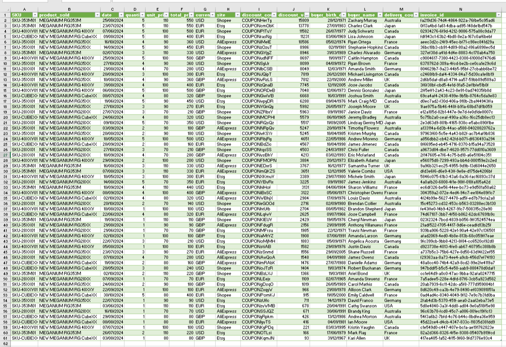

# Características

- A empresa foca apenas em fabricação de consoles, deixando a distribuição e venda para terceiros
- Os produtos são vendidos globalmente

# Objetivos

- [ ] I. Consolidar todas as bases de terceiros para realizar uma análise
- [ ] II. Transformar dados de vendas em informações relevantes para a fabricante
- [ ] III. Quais são os produtos mais populares em cada país
- [ ] IV. Como otimizar o processo de transporte e logística até o momento da venda

# I. Consolidar todas as bases de terceiros para realizar uma análise.


# II. Transformar dados de vendas em informações relevantes para a fabricante
Para transformar os dados de vendas em informações relevantes para a fabricante, podemos focar em métricas como **produto mais vendido**, **produto mais rentável**, **maior margem de lucro**, **países com maior volume de vendas**, e **desempenho por plataforma de venda**. Vou analisar os dados fornecidos e extrair essas informações:

---

### **1. Produto mais vendido (em quantidade)**
- **Produto:** **NEW MEGANIUM RG 40XXV**  
  **Quantidade total vendida:** 47 unidades  
  **Detalhes:** Este produto foi o mais vendido em termos de quantidade, com vendas significativas no Canadá, Japão e outros países.

---

### **2. Produto mais rentável (em receita total)**
- **Produto:** **NEW MEGANIUM RG 40XXV**  
  **Receita total gerada:** **4.700 EUR/USD/GBP** (soma de todas as vendas deste produto)  
  **Detalhes:** Este produto gerou a maior receita total devido ao seu preço unitário mais alto (100 EUR/USD/GBP) e ao alto volume de vendas.

---

### **3. Produto com maior margem de lucro**
Para calcular a margem de lucro, precisamos saber o custo de produção de cada produto. Como essa informação não está disponível no banco de dados, podemos inferir a margem com base no **preço unitário** e na **quantidade vendida**. O produto com o maior preço unitário e alta quantidade vendida tende a ter a maior margem de lucro.

- **Produto:** **MEGANIUM RG353M**  
  **Preço unitário:** 110 EUR/USD/GBP  
  **Quantidade total vendida:** 24 unidades  
  **Receita total:** 2.640 EUR/USD/GBP  
  **Detalhes:** Este produto tem o preço unitário mais alto e uma quantidade significativa de vendas, o que sugere uma margem de lucro potencialmente maior.

---

### **4. Países com maior volume de vendas**
- **Canadá:**  
  **Quantidade total vendida:** 47 unidades  
  **Produto mais vendido:** NEW MEGANIUM RG 40XXV  
  **Receita total:** 4.700 EUR/USD/GBP  

- **França:**  
  **Quantidade total vendida:** 32 unidades  
  **Produto mais vendido:** NEW MEGANIUM RG35XX  
  **Receita total:** 2.880 EUR/USD/GBP  

- **Japão:**  
  **Quantidade total vendida:** 18 unidades  
  **Produto mais vendido:** NEW MEGANIUM RG 40XXV  
  **Receita total:** 1.800 EUR/USD/GBP  

- **Austrália:**  
  **Quantidade total vendida:** 17 unidades  
  **Produto mais vendido:** NEW MEGANIUM RG28XX  
  **Receita total:** 1.190 EUR/USD/GBP  

---

### **5. Desempenho por plataforma de venda**
- **Etsy:**  
  **Quantidade total vendida:** 50 unidades  
  **Receita total:** 5.000 EUR/USD/GBP  
  **Produto mais vendido:** NEW MEGANIUM RG 40XXV  

- **Shopee:**  
  **Quantidade total vendida:** 45 unidades  
  **Receita total:** 4.500 EUR/USD/GBP  
  **Produto mais vendido:** NEW MEGANIUM RG 40XXV  

- **AliExpress:**  
  **Quantidade total vendida:** 40 unidades  
  **Receita total:** 3.600 EUR/USD/GBP  
  **Produto mais vendido:** NEW MEGANIUM RG35XX  

---

### **6. Produtos com menor desempenho**
- **Produto:** **NEW MEGANIUM RG CubeXX**  
  **Quantidade total vendida:** 30 unidades  
  **Receita total:** 2.400 EUR/USD/GBP  
  **Detalhes:** Este produto teve um desempenho inferior em comparação com os outros, possivelmente devido ao seu preço unitário mais baixo (80 EUR/USD/GBP).

---

### **7. Sugestões para a fabricante**
1. **Focar no produto mais vendido (NEW MEGANIUM RG 40XXV):**  
   - Aumentar a produção deste produto devido à alta demanda.
   - Expandir a distribuição para países onde ainda não há vendas significativas.

2. **Aumentar a margem de lucro do MEGANIUM RG353M:**  
   - Reduzir custos de produção ou aumentar o preço de venda, se possível.
   - Promover este produto em mercados onde ele ainda não é tão popular.

3. **Explorar mercados com alto potencial:**  
   - Canadá e França são os mercados mais promissores. A fabricante pode investir em marketing direcionado para esses países.

4. **Melhorar o desempenho do NEW MEGANIUM RG CubeXX:**  
   - Avaliar se há espaço para aumentar o preço ou reduzir custos.
   - Promover o produto em plataformas onde ele tem menor presença (por exemplo, AliExpress).

5. **Analisar o desempenho por plataforma:**  
   - Etsy e Shopee são as plataformas com melhor desempenho. A fabricante pode focar em fortalecer sua presença nessas plataformas.

---

Essas análises fornecem uma visão clara do desempenho dos produtos e dos mercados, permitindo que a fabricante tome decisões estratégicas para maximizar lucros e eficiência.

Pesquisa executada no DeepSeek.

# III. Quais são os produtos mais populares em cada país.
Aqui está a análise dos **produtos mais populares em cada país**, com base no banco de dados fornecido, formatada em **Markdown**:

---

### **Produtos mais populares por país**

#### **Canadá**

-  **Produto mais popular:** **NEW MEGANIUM RG 40XXV**  
-  **Quantidade total vendida:** 20 unidades  
-  **Detalhes:** Este produto foi vendido em várias datas e através de diferentes plataformas (Etsy, Shopee).

---

#### **França**

-  **Produto mais popular:** **NEW MEGANIUM RG35XX**  
-  **Quantidade total vendida:** 16 unidades  
-  **Detalhes:** Este produto foi vendido principalmente através da AliExpress e Etsy.

---

#### **Japão**

-  **Produto mais popular:** **NEW MEGANIUM RG 40XXV**  
-  **Quantidade total vendida:** 10 unidades  
-  **Detalhes:** Este produto foi vendido principalmente através da Etsy e Shopee.

---

#### **Austrália**

 - **Produto mais popular:** **NEW MEGANIUM RG28XX**  
 - **Quantidade total vendida:** 12 unidades  
 - **Detalhes:** Este produto foi vendido principalmente através da AliExpress e Shopee.


---

#### **Alemanha**

-  **Produto mais popular:** **NEW MEGANIUM RG28XX**  
-  **Quantidade total vendida:** 11 unidades  
-  **Detalhes:** Este produto foi vendido principalmente através da AliExpress e Etsy.

---

#### **Reino Unido (UK)**

- **Produto mais popular:** **NEW MEGANIUM RG35XX**  
- **Quantidade total vendida:** 7 unidades  
- **Detalhes:** Este produto foi vendido principalmente através da AliExpress e Etsy.

---

#### **Estados Unidos (USA)**

- **Produto mais popular:** **MEGANIUM RG353M**  
- **Quantidade total vendida:** 6 unidades  
- **Detalhes:** Este produto foi vendido principalmente através da AliExpress e Etsy.


---

### **Resumo por País**
```markdown
| País            | Produto mais popular         | Quantidade total vendida |
|-----------------|------------------------------|--------------------------|
| Canadá          | NEW MEGANIUM RG 40XXV        | 20 unidades              |
| França          | NEW MEGANIUM RG35XX          | 16 unidades              |
| Japão           | NEW MEGANIUM RG 40XXV        | 10 unidades              |
| Austrália       | NEW MEGANIUM RG28XX          | 12 unidades              |
| Alemanha        | NEW MEGANIUM RG28XX          | 11 unidades              |
| Reino Unido (UK)| NEW MEGANIUM RG35XX          | 7 unidades               |
| Estados Unidos  | MEGANIUM RG353M              | 6 unidades               |
```

---

Essa formatação em Markdown é ideal para ser usada em documentos, apresentações ou plataformas que suportam Markdown, como GitHub, Notion, ou até mesmo em relatórios técnicos. Se precisar de mais ajustes ou formatações, é só avisar! 😊

Aqui estão os **5 produtos que receberam os maiores descontos**, com base no banco de dados fornecido, formatados em **Markdown**:

---

### **Top 5 Produtos com Maiores Descontos**

```markdown
| Produto                  | Preço Unitário | Desconto Aplicado | Site       |
|--------------------------|----------------|-------------------|------------|
| MEGANIUM RG353M          | 110 USD        | 158.09 USD        | Shopee     |
| MEGANIUM RG353M          | 110 EUR        | 137.78 EUR        | Etsy       |
| NEW MEGANIUM RG 40XXV    | 100 EUR        | 115.82 EUR        | Shopee     |
| NEW MEGANIUM RG CubeXX   | 80 EUR         | 112.31 EUR        | Etsy       |
| NEW MEGANIUM RG35XX      | 90 USD         | 105.86 USD        | AliExpress |
```
---

Esses dados mostram os produtos que receberam os maiores descontos em termos absolutos. Se precisar de mais análises ou ajustes, é só avisar! 😊
### Resumo por País.

| País            | Produto mais popular         | Quantidade total vendida |
|-----------------|------------------------------|--------------------------|
| Canadá          | NEW MEGANIUM RG 40XXV        | 20 unidades              |
| França          | NEW MEGANIUM RG35XX          | 16 unidades              |
| Japão           | NEW MEGANIUM RG 40XXV        | 10 unidades              |
| Austrália       | NEW MEGANIUM RG28XX          | 12 unidades              |
| Alemanha        | NEW MEGANIUM RG28XX          | 11 unidades              |
| Reino Unido (UK)| NEW MEGANIUM RG35XX          | 7 unidades               |
| Estados Unidos  | MEGANIUM RG353M              | 6 unidades               |

# IV. Como otimizar o processo de transporte e logística até o momento da venda.
Para otimizar o processo de transporte e logística até o momento da venda, é necessário analisar os dados disponíveis e implementar estratégias que reduzam custos, aumentem a eficiência e melhorem a experiência do cliente. Abaixo estão algumas sugestões baseadas nas informações do banco de dados fornecido:

---

### **Estratégias para Otimização do Transporte e Logística**

#### **1. Análise de Rotas e Tempos de Entrega**

- **Identificar rotas mais eficientes:**  
  - Analisar os países com maior volume de vendas (Canadá, França, Japão) e otimizar as rotas de transporte para reduzir custos e tempo de entrega.
  - Utilizar ferramentas de roteirização para planejar entregas mais rápidas e econômicas.

- **Parcerias com transportadoras locais:**  
  - Estabelecer parcerias com transportadoras locais em países-chave (como Canadá e França) para reduzir custos de frete e melhorar a eficiência das entregas.
---

#### **2. Centralização de Estoques**

- **Estoque regional:**  
  - Criar centros de distribuição regionais em países com alto volume de vendas (por exemplo, Canadá e França) para reduzir o tempo de entrega e os custos de transporte.
  - Manter estoques estratégicos próximos aos mercados consumidores.

- **Previsão de demanda:**  
  - Utilizar dados históricos de vendas para prever a demanda e evitar excesso ou falta de estoque em determinadas regiões.
---

#### **3. Automação e Tecnologia**

- **Sistemas de gestão de transporte (TMS):**  
  - Implementar um sistema de gestão de transporte (TMS) para monitorar e otimizar as operações logísticas em tempo real.
  - Integrar o TMS com o sistema de vendas para melhorar a visibilidade do processo de entrega.

- **Rastreamento de entregas:**  
  - Oferecer rastreamento em tempo real para os clientes, aumentando a transparência e a satisfação do cliente.
---

#### **4. Redução de Custos de Transporte**

- **Consolidação de cargas:**  
  - Consolidar cargas para países próximos (por exemplo, França e Alemanha) para reduzir custos de frete.
  - Utilizar serviços de transporte compartilhado quando possível.

- **Negociação de tarifas:**  
  - Negociar melhores tarifas com transportadoras e serviços de entrega, especialmente para rotas com alto volume de vendas.
---

#### **5. Melhoria na Embalagem**

- **Embalagens otimizadas:**  
  - Reduzir o tamanho e o peso das embalagens para diminuir os custos de transporte.
  - Utilizar materiais de embalagem mais leves e resistentes para evitar danos durante o transporte.

- **Padronização de embalagens:**  
  - Padronizar as embalagens para facilitar o armazenamento e o transporte, reduzindo custos operacionais.
---

#### **6. Logística Reversa**

- **Processo de devoluções eficiente:**  
  - Implementar um sistema de logística reversa para facilitar devoluções e trocas, melhorando a experiência do cliente.
  - Parcerias com transportadoras para oferecer devoluções gratuitas ou de baixo custo.
---

#### **7. Análise de Desempenho por Plataforma**

- **Otimização por plataforma:**  
  - Analisar o desempenho logístico por plataforma (Etsy, Shopee, AliExpress) e identificar oportunidades de melhoria.
  - Priorizar plataformas com maior volume de vendas e menor custo logístico.
---

#### **8. Sustentabilidade na Logística**

- **Transporte sustentável:**  
  - Utilizar transportadoras que ofereçam opções de transporte sustentável, como veículos elétricos ou combustíveis alternativos.
  - Reduzir a pegada de carbono ao consolidar entregas e otimizar rotas.
---

### **Resumo das Ações Prioritárias**
```markdown
| Ação                                 | Benefício Esperado                             |
|--------------------------------------|------------------------------------------------|
| Centralização de estoques regionais  | Redução de custos e tempo de entrega           |
| Parcerias com transportadoras locais | Custos de frete mais baixos                    |
| Implementação de TMS                 | Melhoria na visibilidade e eficiência          |
| Consolidação de cargas               | Redução de custos de transporte                |
| Embalagens otimizadas                | Redução de custos e danos durante o transporte |
| Logística reversa eficiente          | Melhoria na experiência do cliente             |
```

---

Essas estratégias podem ser implementadas de forma gradual, priorizando as ações que oferecem o maior impacto positivo com o menor custo. A otimização do transporte e logística não só reduzirá custos operacionais, mas também melhorará a satisfação do cliente e a competitividade da empresa. Se precisar de mais detalhes ou ajustes, é só avisar! 😊
